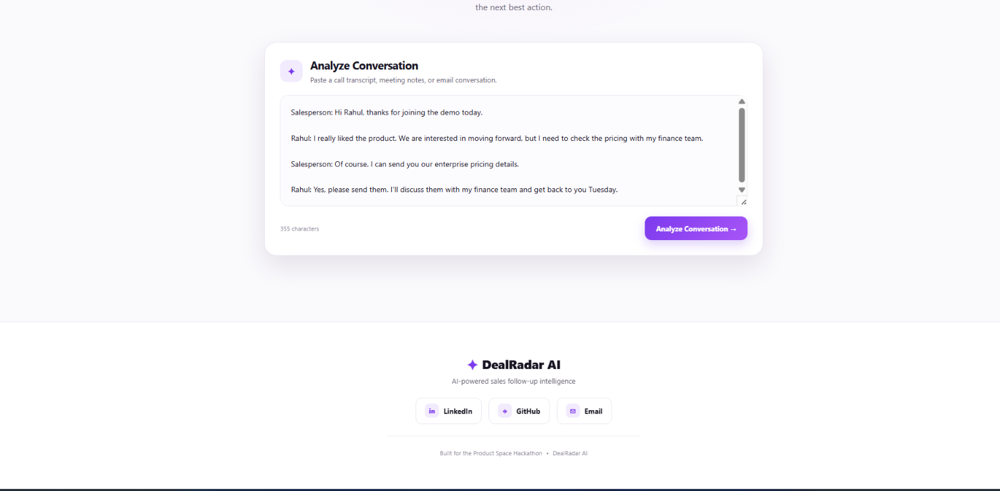
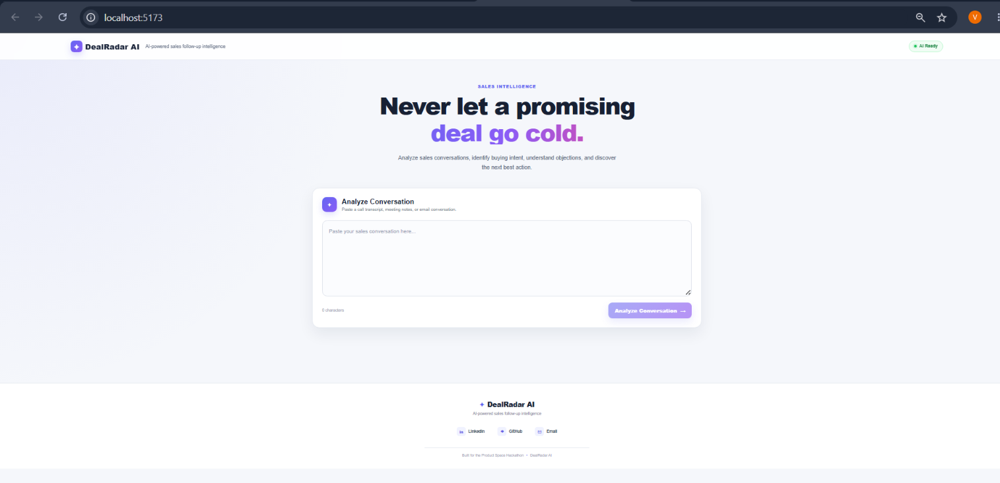
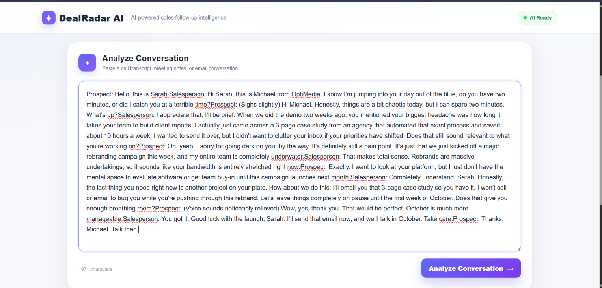
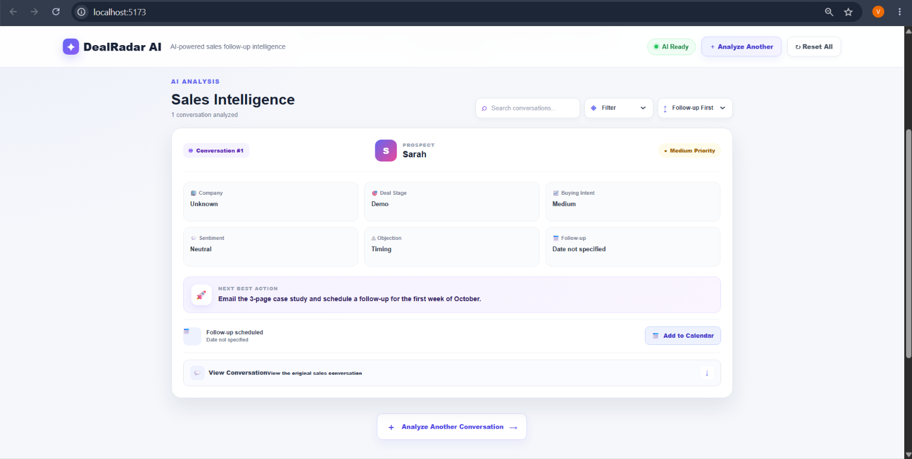
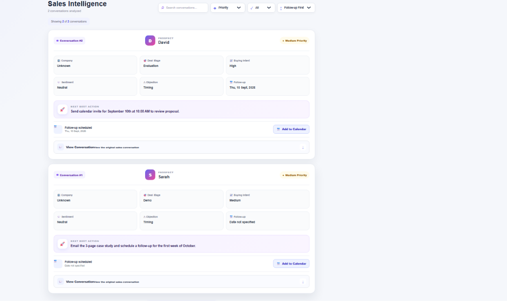
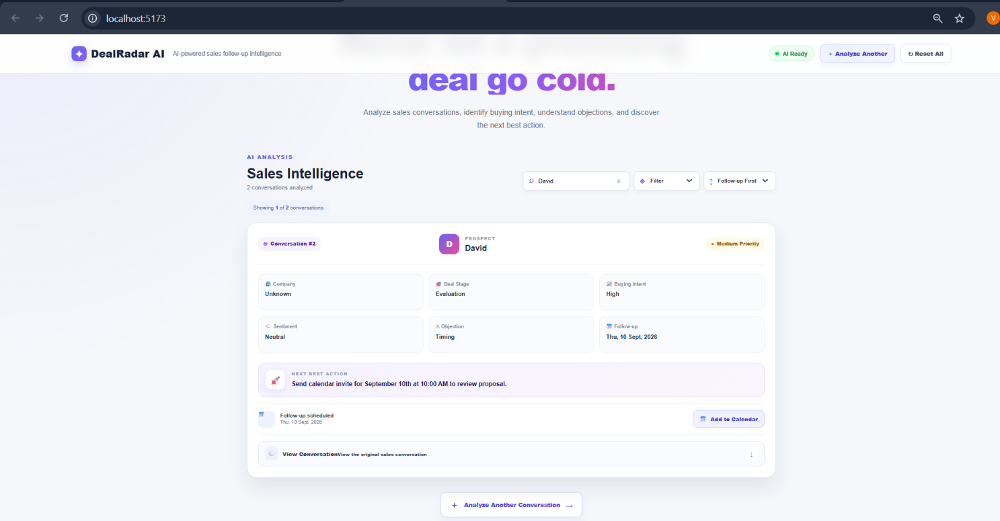
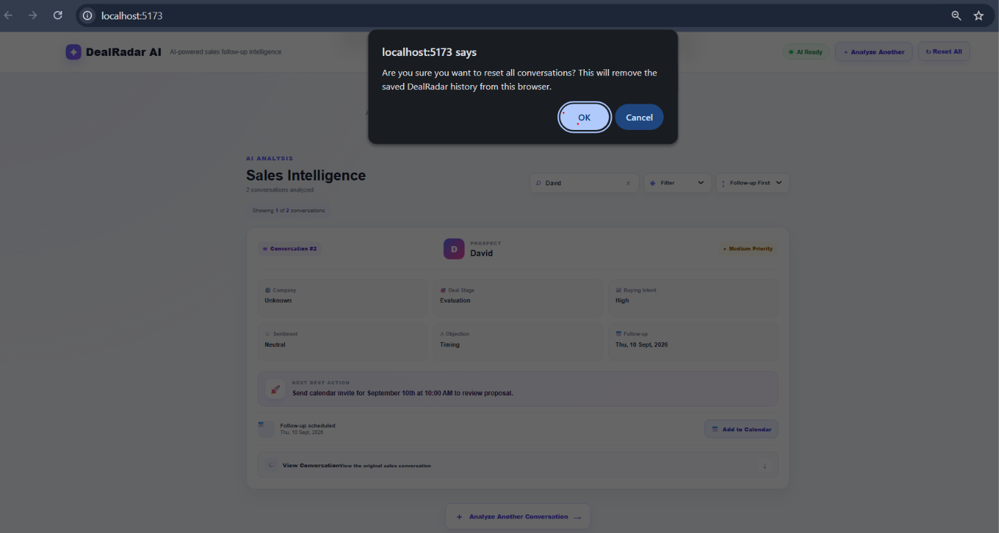

# DealRadar AI

AI-powered sales conversation intelligence that analyzes sales conversations to identify buying intent, sentiment, deal stage, objections, priority, and the next best follow-up action.

DealRadar AI helps sales teams understand conversations faster and avoid letting promising deals go cold.

---
## Live Demo

**Live Application:** https://dealradar-ai-3zf5.onrender.com/

DealRadar AI is deployed as a full-stack application with a React frontend, FastAPI backend, and Gemini AI integration.

### Demo Flow

Sales Conversation → AI Analysis → Sales Intelligence → Follow-up Action

## Overview

DealRadar AI takes a sales conversation, call transcript, meeting notes, or email conversation and analyzes it using AI.

The application extracts important sales signals such as:

- Prospect name
- Company
- Deal stage
- Buying intent
- Sentiment
- Objections
- Deal priority
- Follow-up requirement
- Follow-up date
- Next best action

Analyzed conversations are stored locally in the browser so users can review, search, filter, sort, and manage their sales follow-ups.

---

## Features

### AI Conversation Analysis

Paste a sales conversation and receive structured AI-powered sales insights.

### Sales Intelligence

Each analyzed conversation provides:

- Prospect information
- Company information
- Deal stage
- Buying intent
- Sentiment
- Objections
- Priority
- Follow-up recommendation
- Next best action

### Search

Search across analyzed conversations using:

- Prospect name
- Company
- Deal stage
- Intent
- Sentiment
- Objection
- Priority
- Follow-up date
- Next best action
- Original conversation

### Filters

Filter conversations by:

- Priority
- Buying intent
- Deal stage
- Sentiment

### Sorting

Sort conversations by:

- Follow-up date
- Priority
- Newest analysis
- Latest follow-up

### Follow-up Radar

A dedicated follow-up section highlights upcoming sales follow-ups and places the nearest follow-up first.

### Google Calendar Integration

Follow-up dates can be added directly to Google Calendar.

### Conversation History

Previously analyzed conversations are stored in browser local storage so they remain available after refreshing the page.

### Original Conversation Viewer

Each analysis can be expanded to view the original sales conversation that produced the analysis.

### Responsive UI

The application is designed to work across desktop, tablet, and mobile screen sizes.

---

## Tech Stack

### Frontend

- React
- Vite
- JavaScript
- CSS
- Browser Local Storage
- Google Calendar integration

### Backend

- Python
- FastAPI
- Gemini API

---

## Project Structure

```text
DealRadar-AI/
│
├── backend/
│   └── main.py
│
├── frontend/
│   ├── public/
│   ├── src/
│   │   ├── assets/
│   │   ├── App.jsx
│   │   ├── App.css
│   │   ├── index.css
│   │   └── main.jsx
│   │
│   ├── package.json
│   ├── package-lock.json
│   └── vite.config.js
│
├── .gitignore
├── PRODUCT.md
└── README.md

---

## Running Locally

### 1. Clone the Repository

```bash
git clone https://github.com/pvknvinay0743r/dealradar-ai.git
cd dealradar-ai
---

## Screenshots

### DealRadar AI Dashboard



### Search, Filters & Conversation History



### Follow-up Radar & Google Calendar



### Additional Application View



### Additional Application View



### Additional Application View



### Additional Application View


